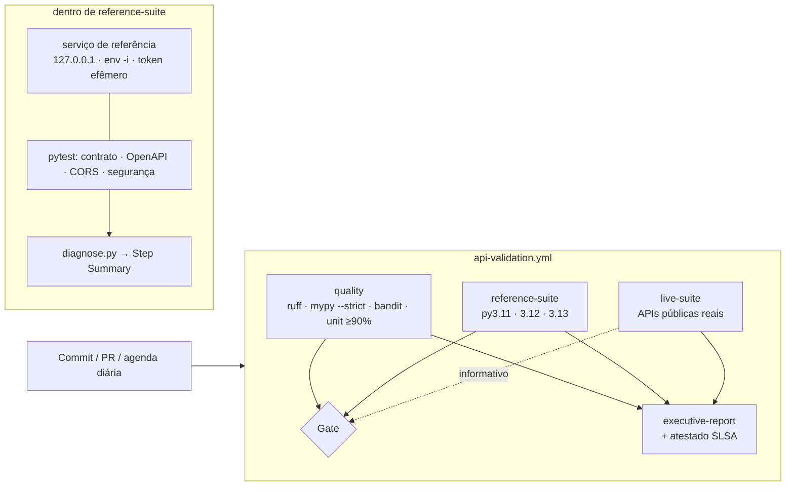

# Arquitetura

## Visão geral
O projeto entrega **um pipeline de validação contínua de APIs** (contrato, CORS e segurança) com
**diagnóstico automático** e **evidência de conformidade**, mais o aplicativo Mente Saudável que o motivou.

## Componentes
| Pacote / arquivo | Responsabilidade | Observação de projeto |
|---|---|---|
| `contracts/openapi.yaml` | **Fonte única da verdade** do contrato, política CORS (`x-cors`) e casos de teste (`x-conformance`) | Mudou o contrato → muda aqui; os testes seguem |
| `reference_service/` | Sistema sob teste: `config` (valida/falha rápido) → `app` (lógica pura, sem sockets) → `server` (HTTP) | Só biblioteca padrão; superfície de ataque mínima |
| `apival/checks.py` | Exceções tipadas e asserções (`ContractViolation`, `CorsPolicyViolation`, `SecurityViolation`) | A classe da exceção classifica a falha, não o texto |
| `apival/contracts.py` | Carrega a especificação e gera casos de conformidade | Valida status **e** corpo contra o schema documentado |
| `apival/classification.py` | Regras ordenadas por precedência | Timeout em teste de CORS = infraestrutura, não política |
| `apival/redaction.py` | Mascara segredos e PII (e-mail, CPF, CNPJ, telefone, IP) | Única porta de saída de texto livre |
| `apival/diagnose.py` + `markdown.py` | JUnit + logs + código de saída → sumário executivo, JSON e anotações | Nunca falha o job: o veredito vem do código original |
| `apival/executive.py` | Relatório de conformidade (MD + HTML) + manifesto SHA-256 | HTML sem JS e sem recurso externo |
| `apival/healthcheck.py` | Health-check com backoff exponencial, detecção de processo morto/zumbi | Códigos de saída contratuais (0 / 3 / 124) |
| `apival/leakscan.py` | Prova que o token efêmero não aparece em nenhum relatório | Lê o segredo de variável de ambiente, nunca de argumento |

## Fronteiras de confiança
1. **Runner efêmero** (VM descartável por job) ↔ repositório: `GITHUB_TOKEN` somente leitura por padrão.
2. **Serviço sob teste** ↔ runner: processo iniciado com `env -i` (sem herdar segredos), escutando só em loopback.
3. **Pipeline** ↔ **APIs de terceiros**: o token do serviço nunca é enviado a terceiros (fixtures separadas `api` e `public`).
4. **Relatórios** ↔ leitores: todo texto passa por `redact` antes de sair; HTML é escapado.

## Decisões e trade-offs
- **Serviço de referência em stdlib** (não FastAPI/Flask): zero dependências no sistema sob teste e comportamento 100% determinístico. Trade-off: não substitui testar o backend real, por isso `service_start_command` permite apontar para ele.
- **Contrato dirigido por OpenAPI**: evita que documentação e testes divirjam. Trade-off: exige manter `x-conformance`.
- **Suíte `live` informativa**: terceiros oscilam; reprovar o merge por isso gera ruído e desconfiança no pipeline. O gate é configurável (`live_blocking`).
- **Dependências com hash** (`--require-hashes`): impede troca silenciosa de pacote. Trade-off: atualização exige `make lock`.
- **Sem canal de log provisório**: o diagnóstico vive no Step Summary, anotações e artefatos, sem escrita em branches.

## Capacidade e desempenho (medidos)
Suíte de sistema: ~6 s (97 testes). Unitários: ~9 s (104 testes, 96% de cobertura). Por perna de matriz, o tempo
total é dominado por checkout + instalação (com cache de pip).
